<!---
\newpage
--> 


# SPI-based Communication protocol
The standard Serial Peripheral Interface (SPI) which uses the MASTER-SLAVE principle has 4 lines of data transmission (spi_clk, MISO, MOSI, SS). 
However, even when our designed protocol also uses the Master-Slave principle it only has 2 lines of data transmission since we only have one slave, and the communication only goes from the master to the slave. 
In other words, our communication line, as shown in Figure 1,  has a generated clock (SPI_clk) and the MOSI (Master Output, Slave Input)  


## Details of our SPI-based protocol 
Our protocol is based on five blocks:.

* A **Clock generator** generates the SPI clock
* **Rising edge detectors**  detect the rising edges of the SPI clock. We need it because the SPI clock is not ideal (instant change between '0' and '1'); in other words, it takes some time to change from '0' to '1' and vice versa as can be observed in Figure 2..
* **Delays** that work as synchronizers  since the SPI clock is not ideal we need to avoid reading data from any signal during value transitions. 
* The **SPI transmission component**  is in charge of sending the data through TX port
* The **SPI reception component** is in charge of receiving the data through RX port


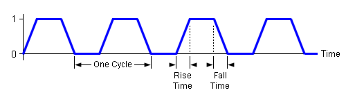{height=15%}


# Communication Components
All the components in our design have a internal clock signal as well as an asynchronous reset signal.

## Clock Generator
We used a state machine with only two states (ONE, ZERO) and a counter to generated the clock signal that will be used as `SPI clock`. In each state we reset the counter to zero and it starts counting up to some fixed maximum count, in our case is maximum count fixed to ten. 
Which means that our generated clock will run twenty times slower which is more than enough to ensure that there will not be missing bits..
The entity of this block is as follows:


```vhdl
entity clk_generator is
    port (  clk: in std_logic; 
            reset: in std_logic; 
            en: in std_logic;
            clk_out: out std_logic
         );
end entity clk_generator;
```

The output of a testbench can be observed in Figure 3.

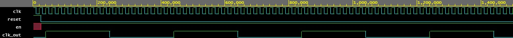

## Delay or synchronizer
This block is basically a flip flops type D. The entity definition is presented as well as the testbench result (Figure 4). 

```vhdl
entity  delay_sync is
    port (  clk: in std_logic;
            reset: in std_logic;
            d: in std_logic;
            q: out std_logic
         );
end entity delay_sync;
```

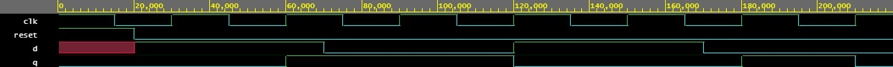

## Rising Edge Detector
This component has the following entity definition:


```vhdl
entity rising_edge_detector is
    port (  clk: in std_logic;
            reset: in std_logic; 
            clk_in: in std_logic;
            edge: out std_logic
         ); 
end entity rising_edge_detector;
``` 
{height=20%}

This block is based on a state machine with three states (ONE, ZERO, RISING_EDGE). The state machine is presented in Figure 5. The initial state is ZERO, once the clock changes to `1` the detector goes to RISING_EDGE state. In the RISING_EDGE state `edge` is set to `1`, which means that a rising edge has been detected; afterwards, whether the clock signal is `0` or `1` the next state is either `ZERO` or `ONE`. If the next state is `ONE`, the component will be in that state until the clock signal changes to `0`.  

The testbench result is presented in Figure 6.

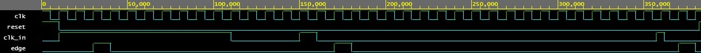

## SPI TX component
The entity definition of this component is as follows: 

```vhdl
entity spi_tx is
    port (  clk: in std_logic;
            reset: in std_logic;
            edge: in std_logic;  
            data: in std_logic_vector (7 downto 0);
            empty_buf: out std_logic;
            tx: out std_logic
         );
end entity spi_tx; 
```
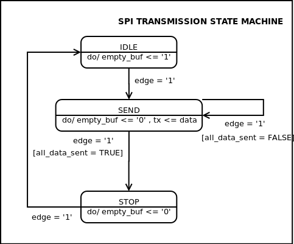{height=20%}

The behavior of this component is shown in Figure 7. The SPI TX component will be in state IDLE until an `edge` is detected. Note when the component is in IDLE, it is waiting for data to send; thus,  transmission buffer is empty ( `empty_buf <= '1'`). 
 Once an edge is detected the component goes to SEND state. It's in this state where the serial transmission takes place. In every detected edge a bit is sent through TX port, also the flag that states the transmission is taking place is sent to `0` (`empty_buf <= '0'`). In our case the least significant bit is sent first.
Once all the data is sent (`all_data_sent = TRUE`), the component goes to STOP state. In this state the component makes sure that the last sent bit had enough time to be received without problems. Finally, in the next `edge` the component goes to IDLE state. The results of the testbench can be observed in Figure 8.


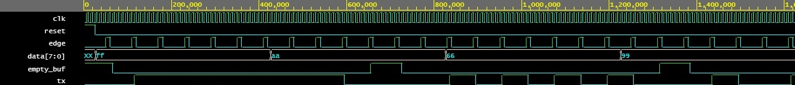

## SPI RX component
The entity definition of this component is as follows: 

```vhdl
entity spi_rx is
    port (  clk: in std_logic;
            reset: in std_logic;
            edge: in std_logic;  
            rx: in std_logic;
            data: out std_logic_vector (7 downto 0);
            full_buf: out std_logic
         );
end entity spi_rx; 
```
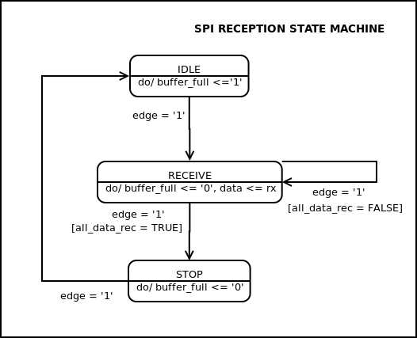{height=20%}

This component behavior is shown in Figure 9. The SPI RX component will be in state IDLE until an `edge` is detected. Similar to transmission block, the component reception buffer is set to 1 ( `buffer_full <= '1'`) as long as it is IDLE state.
 When an edge is detected the component goes to SEND state starting the data frame reception. In every detected edge a bit is received through the RX port, also the flag that states the reception is taking place is set to `0` (`buffer_full <= '0'`). Note that the least significant bit is received first. The reception is done by using a shifting register. 
Once all the data is received (`all_data_rec = TRUE`), the component goes to STOP state. In this state the component makes sure that all the bits have been received and the new data is ready to be read. Finally, in the next `edge` the component goes to IDLE state again.   

The results of the testbench can be observed in Figure 10.

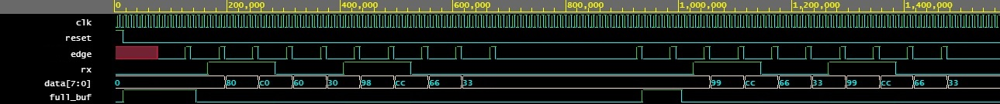

# SPI Transmission block
This block is in charge of transmiting the data from `DATA` using our SPI protocol. This block should be implemented in the master device. The internal block diagram is presented in Figure 11. 
Our transmission block has: 2 inputs: Enable SPI clock signal `EN` and data to transmit `DATA`; and 3 outputs: A buffer `empty_buffer` that works as feedback to other blocks that want to send data through our SPI channel, in other words, tells the other blocks whether this block is ready to send data (`empty_buf = '1'`)  or not (`empty_buf = '0'`). The SPI generated clock `SPI_clk`  used to synchronize the communication between master and slave, and the transmission pin `TX`. 
 


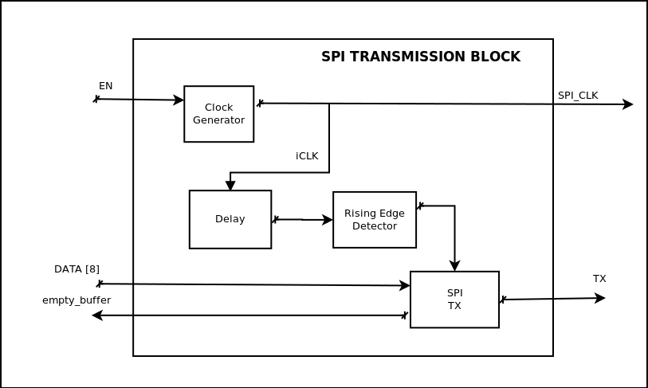

As it can be observed in Figure 11, our design includes 4 blocks. A clock generator that will generated the `SPI_clk`  that runs 20 times slower than the FPGA internal clock); a delay or synchronizer that is used to avoid reading data during ramps in the `SPI_clk`; a rising edge detector, used to detect rising edges in our `SPI_clk`; and the proper SPI transmission component which is in charge of transmiting the data.   

The entity definition is as follows:

```vhdl
entity spi_block_tx is
    port (  clk: in std_logic; 
            reset: in std_logic; 
            data: in std_logic_vector (7 downto 0);
            en: in std_logic; 
            empty_buf: out std_logic; 
            clk_spi: out std_logic;
            tx: out std_logic
        );
end entity spi_block_tx; 
```

A pseudocode of the main functionality of the SPI transmission block is presented

```vhdl
-- SPI transmission block pseudocode  
while (EN = '1') 
    generate(SPI_clk)
    while ( isSendingData )
        empty_buffer <= '0'
        if ( rising_edge_detector (SPI_clk) )
            TX <= send_BIT
    
    empty_buffer <= '1'
```

The testbench result can be observed in Figure 12. 


# SPI Reception block 

This block is in charge of receiving the data frame from `RX`. This block should be implemented in the slave device. The internal block diagram is presented in Figure 13. 
This block has 2 inputs: the SPI generated clock `SPI_clk` form master, and the reception frame `RX`; also has two outputs: the received data `data` and a buffer `buffer_full` that tell other blocks that there is data ready to be read. 

The entity definition is as follows:

```vhdl
entity spi_block_rx is
    port (  clk: in std_logic; 
            reset: in std_logic; 
            clk_spi: in std_logic;
            rx: in std_logic;
            data: out std_logic_vector (7 downto 0);
            full_buf: out std_logic
        );
end entity spi_block_rx; 
```

 
As it can be observed in Figure 13, our design includes three blocks. A delay or synchronizer that is used to avoid reading data during ramps in the `SPI_clk`;  rising edge detector, used to detect rising edges of our `SPI_clk`; and the SPI reception component which is in charge of receiving the data frame.   


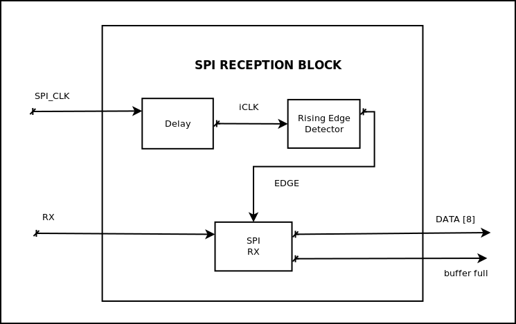{height=30%}

A pseudocode of the main functionality of the SPI receiving block is as follows:

```vhdl
-- SPI reception block Pseudocode 
while ( rising_edge_detected )
    buffer_full <= '0'
    data <= fill_with(rx_BIT)

buffer_full <= '1'
inMemory(data) 
```

The testbench results of the SPI reception block can be observed in Figure  14.

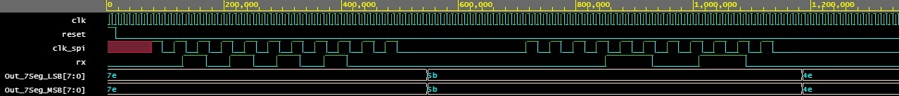{height=30%}


# Test Case
We tested our SPI-based protocol using to FPGAs. The goal was to send a telegram from one FPGA to another using serial communication. Both FPGAs should be able to send a telegram, in other words, each FPGA was  master and slave at the same time; thus, we used two lines of communication (Figure 15),  from the FPGA number 1 to FPGA number 2 (comm_line_1to2) and vice versa (comm_line_2to1).
It is important to mention that the lines of data transmission shown in Figure 1 were considered as **one line of communication**, for instance the `SPI_clk` and `RX-TX` lines are considered as one cummunication line. 

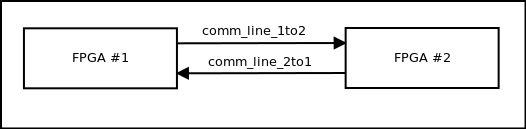

 The telegram was 8-bit long and this information should be displayed in two 7-segment screen located in the other FPGA. 


In Figure 16 can be observed the only communication between master and slave.  Note the inputs were a push button and a dip switch. **Input interface** block was in charge of manage the telegram, when the button was pressed the telegram given by the dip switch was sent through the transmission port (`TX`) if the transmission buffer were empty (`empty_buffer == 1`).

 And after reception the **decoder block** used the data collected by **reception block** to decode the telegram in two data arrays (LSD - Least significant digit and MSD - Most significant digit), and  both numbers were displayed in two 7-Segment displays.


We already discussed how the **reception block** and **transmission block** work. Now we will focus on the **Input interface** and **decoder**. 
The input interface  block send the data once the user release the push button if the transmission buffer is free, if the transmission buffer is not free no data is sent. 
The decoder block read the data from reception block once reception buffer is full. Then we use a look up table to get the LSD and MSD in 7-Segment format. 


